# The Black Cap — Website Guide

This guide explains how to install the website and how to edit every section. No technical knowledge is assumed beyond the basics of logging into WordPress.

---

## Contents

1. [Installation](#1-installation)
2. [First-time setup — running the import](#2-first-time-setup--running-the-import)
3. [API settings — Eventbrite & TikTok](#3-api-settings--eventbrite--tiktok)
4. [How to edit the page](#4-how-to-edit-the-page)
   - [Opening the page editor](#opening-the-page-editor)
   - [What's On](#whats-on)
   - [Story](#story)
   - [Timeline](#timeline)
   - [Highlights (TikTok videos)](#highlights-tiktok-videos)
   - [Drinks Menu](#drinks-menu)
   - [Our Rooms](#our-rooms)
   - [Venue Hire](#venue-hire)
5. [Editing rooms and venues in detail](#5-editing-rooms-and-venues-in-detail)
6. [Social media links](#6-social-media-links)
7. [Clearing the cache](#7-clearing-the-cache)

---

## 1. Installation

### Step 1 — Upload the plugin

1. Log in to your WordPress admin panel (usually `yoursite.com/wp-admin`).
2. In the left-hand menu, go to **Plugins → Add New**.
3. Click **Upload Plugin** (top of page).
4. Click **Choose File**, select the `the-black-cap.zip` file you were given, then click **Install Now**.

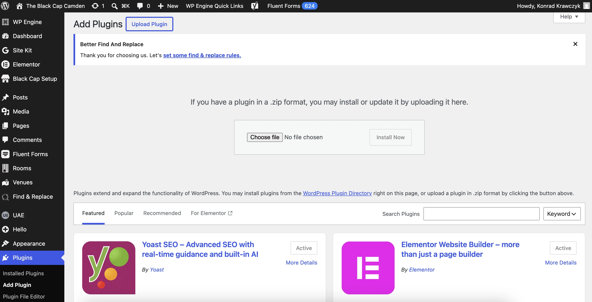

5. Once installed, click **Activate Plugin**.

You should now see "The Black Cap" listed under **Plugins → Installed Plugins** and marked as Active.

---

## 2. First-time setup — running the import

The import wizard populates the page with all its content automatically: room photos, venue descriptions, the timeline, the drinks menu, and everything else.

**You only need to run this once.** Running it again on an existing site is safe — it skips anything already imported and only updates what has changed.

### Step 1 — Open the setup page

In the WordPress left-hand menu, go to **The Black Cap → Setup**.

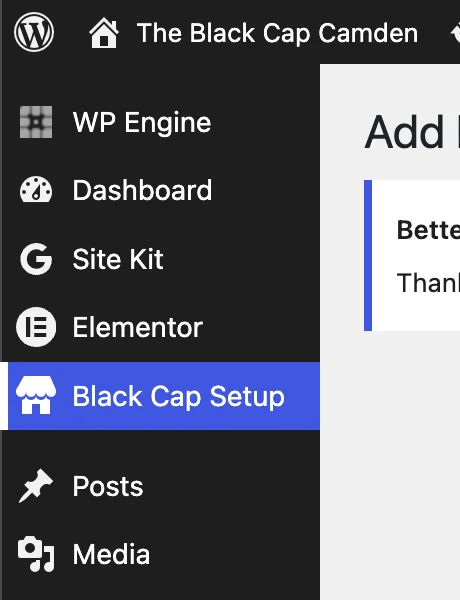

### Step 2 — Choose a mode

You will see two options:

- **Production** — writes content directly to the live front page. Use this for the real launch.
- **Staging** — creates a separate hidden preview page (`/tbc-staging`) so you can check everything before going live. Safe to use any time.

### Step 3 — Run the import

Click **Run Setup**. A progress log will appear showing each step as it completes. The steps are:

| Step | What it does |
|---|---|
| Room images | Downloads room photos from the booking system |
| Room posts | Creates the "Our Rooms" entries |
| Timeline images | Uploads the timeline photos |
| Venue images | Uploads venue space photos |
| Venue posts | Creates the "Venue Hire" entries |
| Front page | Builds the homepage with all sections |
| Navigation | Sets up the top navigation menu |
| API defaults | Seeds the Eventbrite organisation ID |

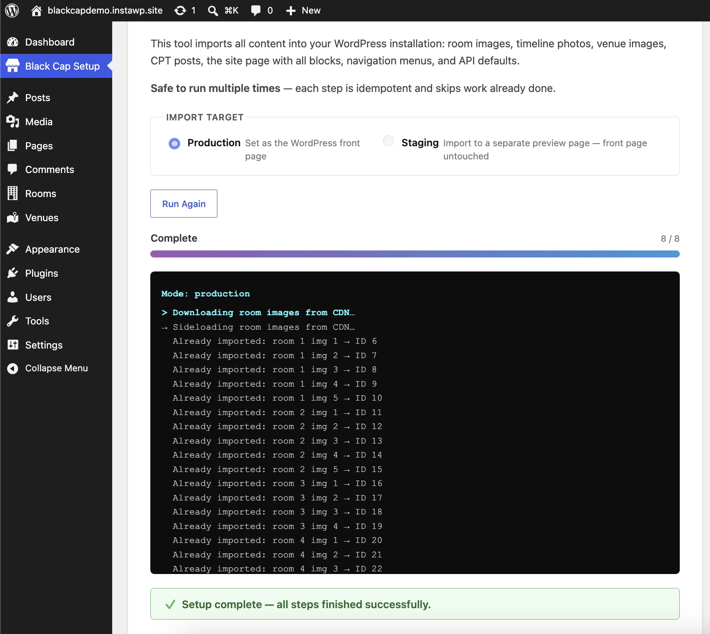

When it finishes you will see **Done** at the bottom of the log. If you used Staging mode, a link to the preview page appears — click it to check the result.

---

## 3. API settings — Eventbrite & TikTok

These settings connect the site to live event and video feeds. Go to **Settings → Black Cap** in the left-hand menu.

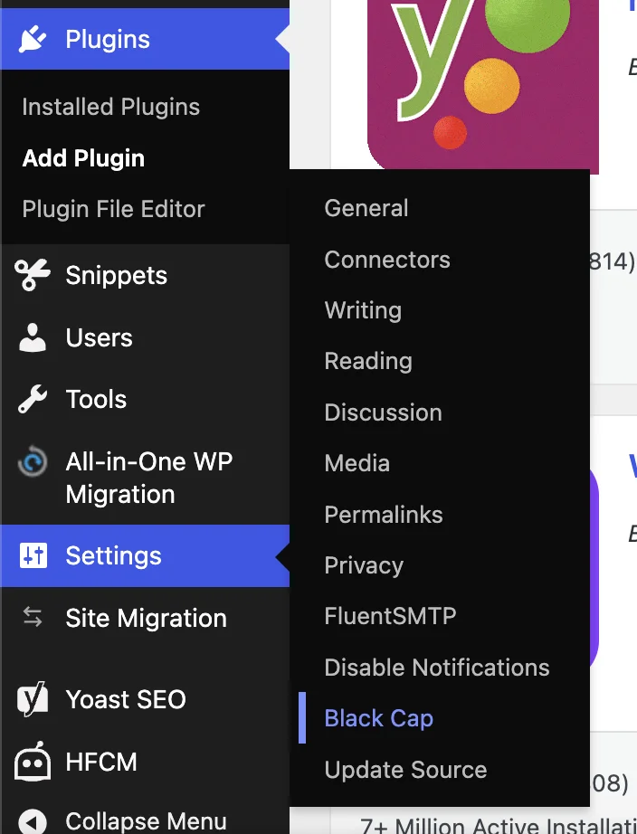

### Eventbrite (What's On section)

The What's On section shows upcoming events automatically when an API token is set.

| Field | Where to find it |
|---|---|
| **Eventbrite API Token** | eventbrite.com → Account Settings (avatar top-right) → Developer Links → API Keys → create a key and copy the **Private Token** |
| **Eventbrite Organisation ID** | Open your organiser dashboard on Eventbrite — the long number at the end of the URL is your org ID (e.g. `eventbrite.com/o/black-cap-3005226258349` → the ID is `3005226258349`) |

After pasting both values, click **Save Changes**.

### TikTok (Highlights section)

TikTok requires a developer app. This is a one-time technical setup — contact your developer if you need help with it. Once configured, the latest videos appear automatically and the refresh token is rotated silently in the background.

| Field | Where to find it |
|---|---|
| **TikTok Client Key** | developers.tiktok.com → your app → App info |
| **TikTok Client Secret** | Same page. Keep this private. |
| **TikTok Refresh Token** | Obtained during the one-time OAuth flow |
| **TikTok Profile URL** | Your TikTok page URL, e.g. `https://www.tiktok.com/@theblackcapcamden` |

### Social links

Also on this page you can set the **Instagram** and **Facebook** profile URLs that appear in the site footer and navigation.

---

## 4. How to edit the page

### Opening the page editor

1. In the left-hand menu, go to **Pages → All Pages**.
2. Click on the page called **Home**.
3. The block editor opens. You will see the page made up of sections stacked vertically.

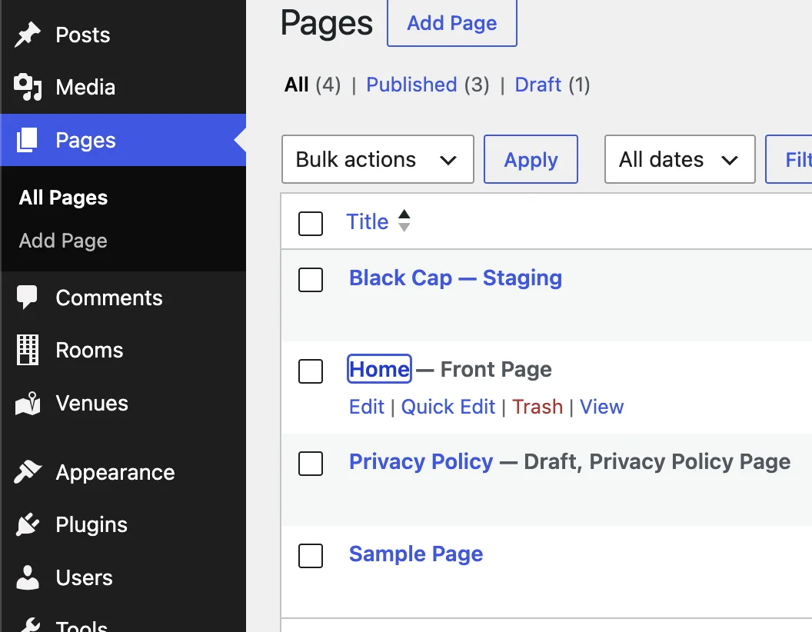

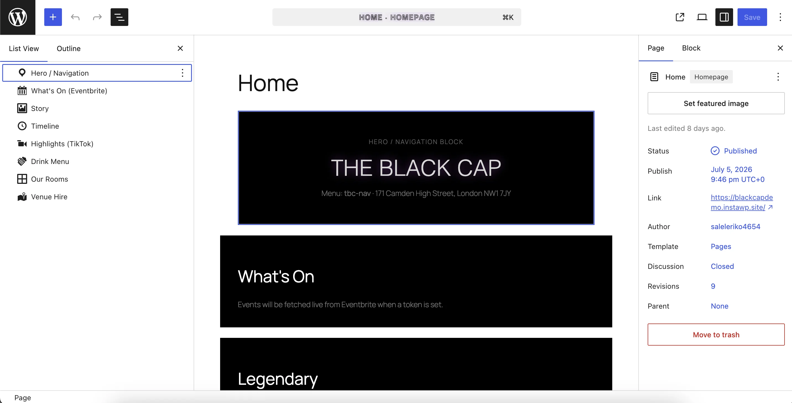

### How the editor works — a quick orientation

Each section of the page is a **block**. To edit a block:

1. Click on it in the canvas to select it.
2. Look at the **right-hand panel** — this is where all the settings appear. If the panel is hidden, click the **Settings** icon (gear icon) in the top-right corner of the screen.
3. Make your changes in the right-hand panel, then click the blue **Save** button at the top right.

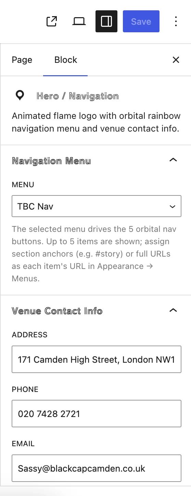

**Important:** Most sections do not have visible controls on the canvas itself — everything is in the right-hand panel. Don't be surprised if a section looks minimal in the editor; it will render fully on the front end.

---

### What's On

This section shows upcoming events from Eventbrite.

**To change the heading:**
1. Click the What's On block.
2. In the right-hand panel, open **Section Heading**.
3. Edit the **Heading text** field.

**To configure events:**
1. In the right-hand panel, open **Eventbrite Settings**.
2. **Max events to show** — drag the slider to set how many events appear.
3. **Fallback event IDs** — these are used only if the Eventbrite API is unavailable. Paste comma-separated numeric event IDs (the number at the end of any Eventbrite event URL). Leave this blank if you have API credentials set.

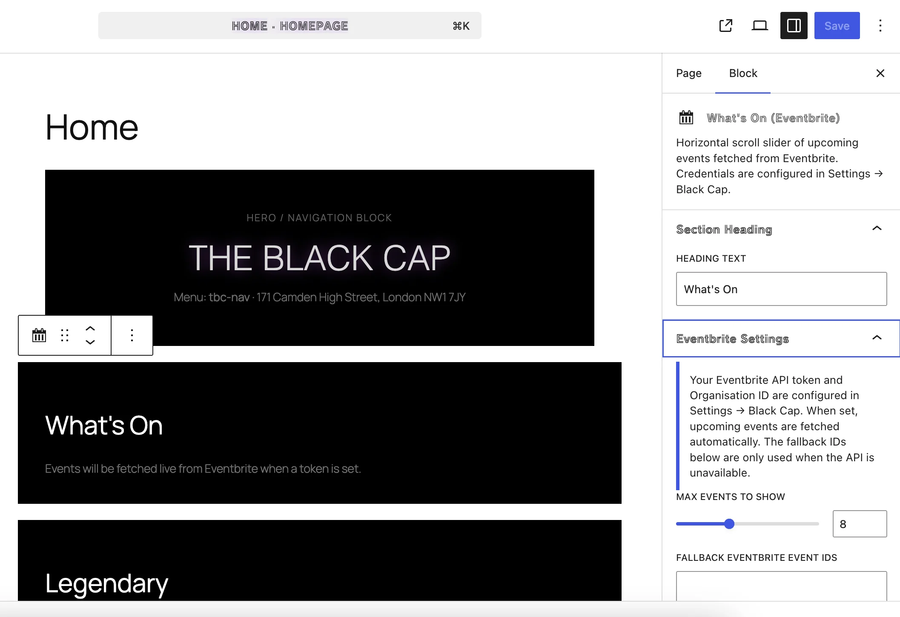

---

### Story

The Story section has a large heading, a paragraph of text, and floating photos.

**To edit the heading and text:**
Click directly on the heading or paragraph text in the canvas — they are editable in place.

**To change the photos:**
1. Click the Story block.
2. In the right-hand panel, open **Photos & Parallax**.
3. Each photo listed has three sliders:
   - **Scale** — how large the photo appears relative to its container.
   - **Drift X** — how far left or right the photo floats as you scroll.
   - **Drift Y** — how far up or down the photo floats as you scroll.
4. To remove a photo, click **Remove photo** under it.
5. To add photos, click **Add photos** at the bottom and choose from the media library.

**To turn off the floating effect:**
In the right-hand panel, open **Animation** and toggle **Floating parallax** off. Photos will fade in on scroll instead of drifting.

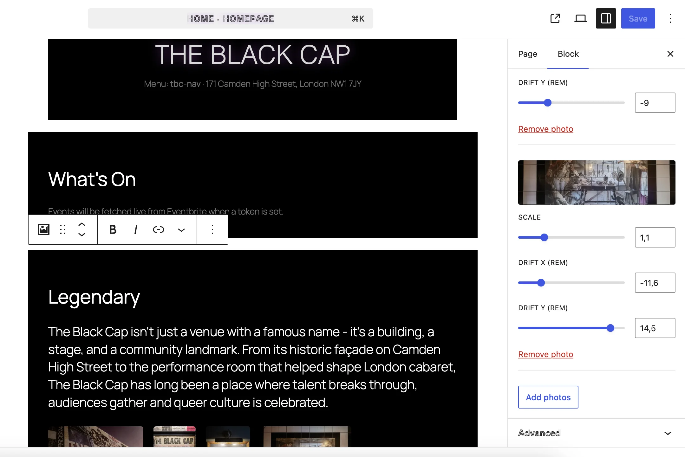

---

### Timeline

The Timeline is the history section. It has an intro paragraph and a series of dated entries, each with a title, description, and optional photos.

**To edit the intro text:**
1. Click the Timeline block.
2. In the canvas, find the **Intro Text** field at the top of the block and type directly into it.

**To edit an entry:**
Each entry has:
- **Years** — the date range shown on the card (e.g. `1960s–1980s`)
- **Title** — the bold heading
- **Description** — the body text (supports multiple paragraphs)
- **Photos** — click **Add photos** / **Edit photos** to pick images from the media library

**To reorder entries:**
Use the up (↑) and down (↓) arrow buttons on each entry.

**To add a new entry:**
Click the **+ Add Entry** button at the bottom of the block.

**To remove an entry:**
Click the rubbish-bin icon on the entry.

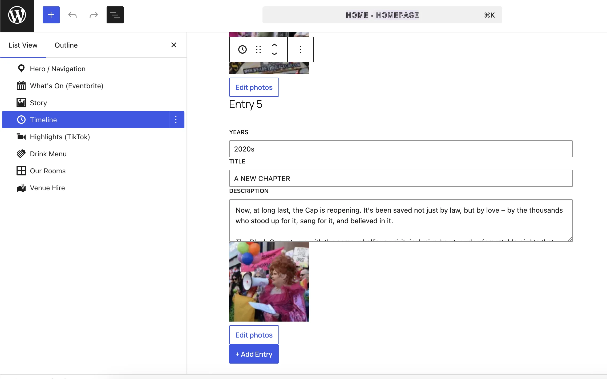

---

### Highlights (TikTok videos)

This section shows a horizontal scrolling row of TikTok videos.

**To change the heading:**
1. Click the Highlights block.
2. In the right-hand panel, open **Section Heading** and edit **Heading text**.

**To configure videos:**
1. In the right-hand panel, open **TikTok Settings**.
2. **Display mode** — choose **Thumbnails** (click-to-play, loads faster) or **Embedded player** (player visible immediately).
3. **Number of videos** — drag the slider.
4. **Fallback video IDs** — paste comma-separated TikTok video IDs (the long number in a TikTok URL, e.g. `7644927884900961558`). Used when the API is unavailable.

**To change the "Follow us on TikTok" link:**
In the right-hand panel, open **Profile Link** and update the URL and button label.

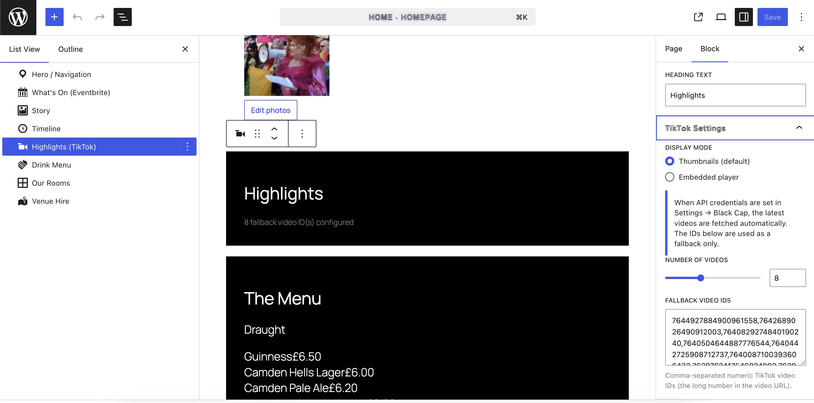

---

### Drinks Menu

The menu is organised into categories (e.g. Draught, Wine, Cocktails), each with items and prices.

**To change the heading:**
1. Click the Drinks Menu block.
2. In the right-hand panel, open **Section Heading** and edit **Heading text**.

**To manage categories and items:**
1. In the right-hand panel, open **Menu Sections**.

**Adding a category:**
Click **+ Add section** at the bottom. A new category appears. Type its name in the **Category name** field.

**Removing a category:**
Click **Remove** next to the category name.

**Adding an item:**
Click **+ Add item** inside a category. Fill in the **Item name** and **Price** fields.

**Removing an item:**
Click the ✕ button at the right of the item row.

**Adding a photo to an item:**
Each item has a small camera icon (📷) to its left. Click it to open the media library and choose a photo. A thumbnail appears on the item row. Visitors can tap the thumbnail to see the full photo.

To remove a photo from an item, click the small red **✕** that appears below the thumbnail.

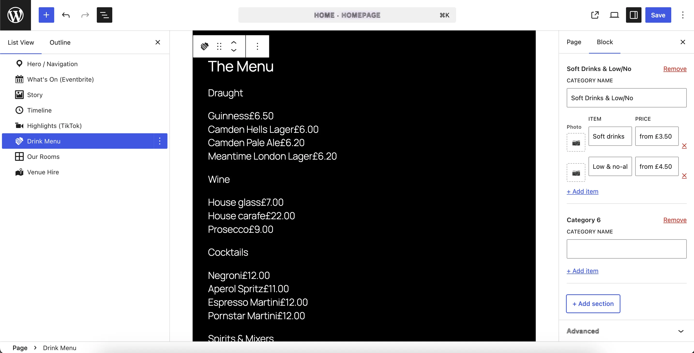

---

### Our Rooms

This section shows the hotel rooms in decorative frames.

**To change the heading:**
1. Click the Our Rooms block.
2. In the right-hand panel, open **Section Heading** and edit **Heading text**.

**To manage the frames:**
1. In the right-hand panel, open **Frames**.

Each frame has three settings:
- **Frame shape** — choose from Frame 1 through Frame 8 (these are the decorative SVG borders).
- **Room** — pick which hotel room to link to this frame. The room's photos are displayed inside the frame on the front end.
- **Wide (span 2 columns)** — toggle on to make this frame take up double width in the grid.

**Adding a frame:**
Click **+ Add frame** at the bottom.

**Removing a frame:**
Click **Remove** on the frame you want to delete.

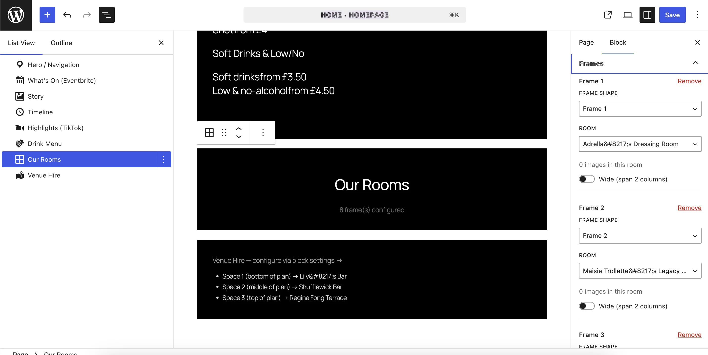

The actual room content (name, description, photos) is edited separately — see [Editing rooms and venues in detail](#5-editing-rooms-and-venues-in-detail).

---

### Venue Hire

This section shows the hireable spaces with an interactive floor-plan diagram.

**To change the heading:**
1. Click the Venue Hire block.
2. In the right-hand panel, open **Section Heading** and edit **Heading text**.

**To change which space appears in each slot:**
1. In the right-hand panel, open **Venue Mapping**.
2. Three dropdowns correspond to the three spaces on the floor plan:
   - **Space 1 (bottom of plan)** — typically Lily's Bar (ground floor)
   - **Space 2 (middle of plan)** — typically Ms Shufflewick Bar (first floor)
   - **Space 3 (top of plan)** — typically Regina Fong Terrace (rooftop)
3. Choose a venue from each dropdown.

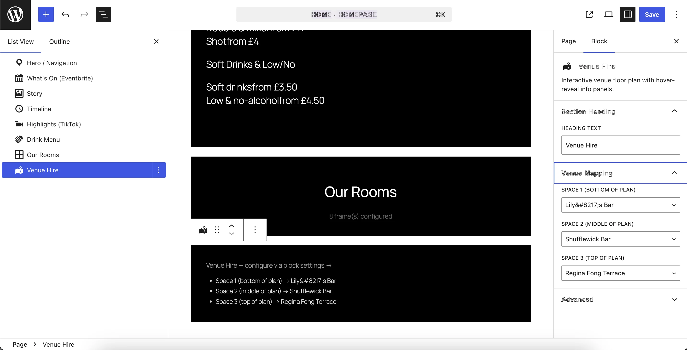

The actual venue content (name, description, photo) is edited separately — see [Editing rooms and venues in detail](#5-editing-rooms-and-venues-in-detail) below.

---

## 5. Editing rooms and venues in detail

Rooms and venues are managed as separate entries in WordPress, not directly inside the page blocks.

### Editing a Room

1. In the left-hand menu, go to **Rooms** (listed under the main menu).
2. Click on the room you want to edit.

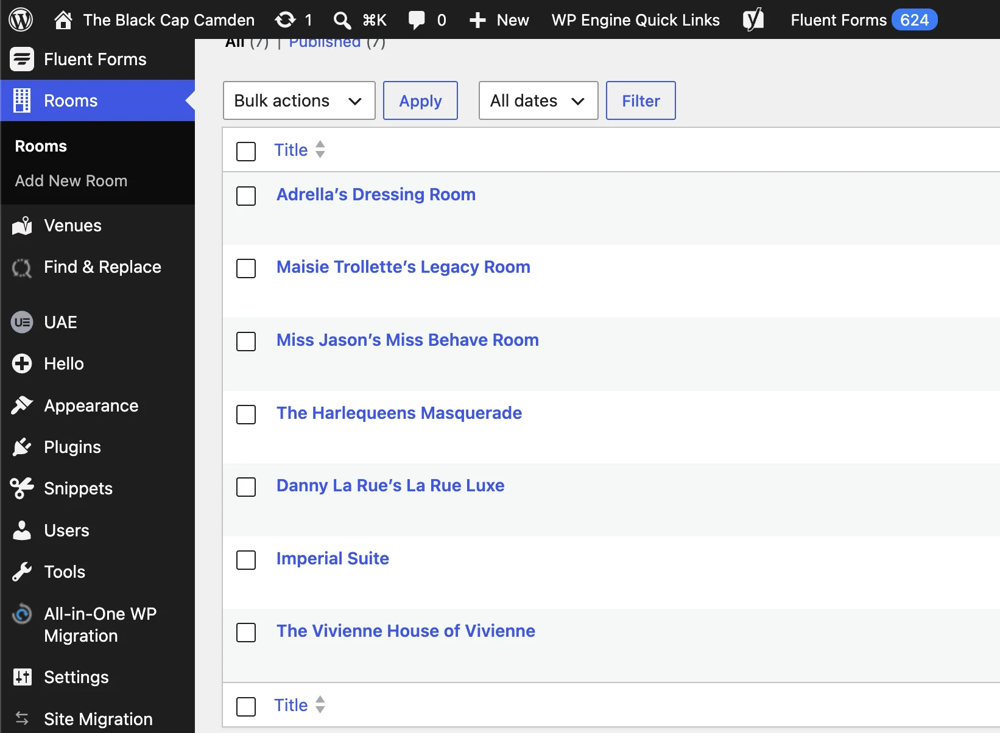

Each room entry has:
- **Title** — the room name as shown on the website (e.g. "Adrella's Dressing Room").
- **Description** — the text that appears in the room lightbox. You can write multiple paragraphs.
- **Photos** — a list of image IDs from the media library. These are the photos that cycle inside the decorative frame on the website.

To change photos, click **Select Images** and choose from the media library. You can select multiple images.

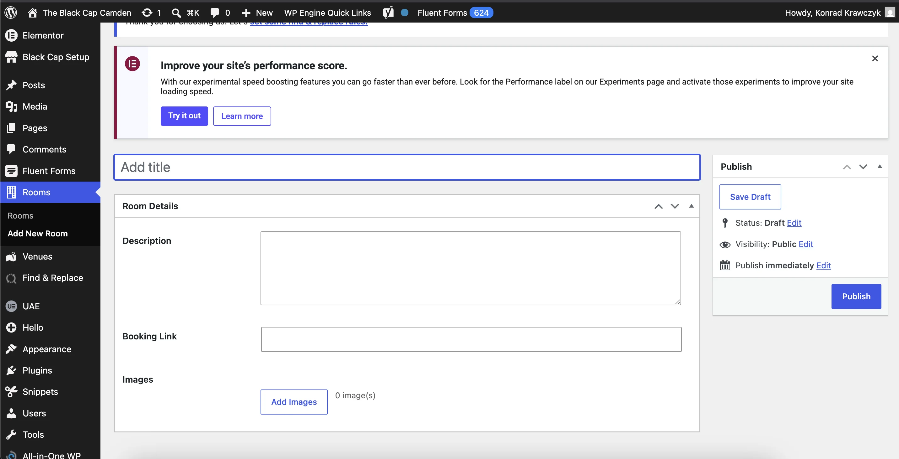

After editing, click **Update** (top right) to save.

### Editing a Venue Space

1. In the left-hand menu, go to **Venues**.
2. Click on the venue you want to edit (e.g. "Lily's Bar").

Each venue entry has:
- **Title** — the space name.
- **Description** — the text shown when a visitor taps the space on the floor plan.
- **Photo** — a single image shown alongside the description.

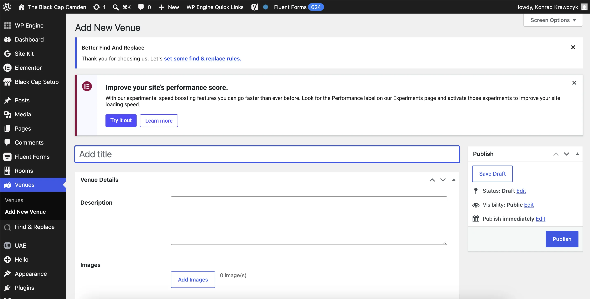

Click **Update** to save changes.

---

## 6. Social media links

Social media URLs (Instagram, Facebook, TikTok) are set in **Settings → Black Cap**. See [API settings](#3-api-settings--eventbrite--tiktok) above.

These URLs appear in the site's navigation and footer.

---

## 7. Clearing the cache

Events (Eventbrite) and videos (TikTok) are cached for one hour to keep the page fast. If you publish a new event or video and want it to appear immediately:

1. Go to **Settings → Black Cap**.
2. Scroll to the bottom and click **Clear API cache**.
3. A green confirmation message appears. The next page load will fetch fresh content.

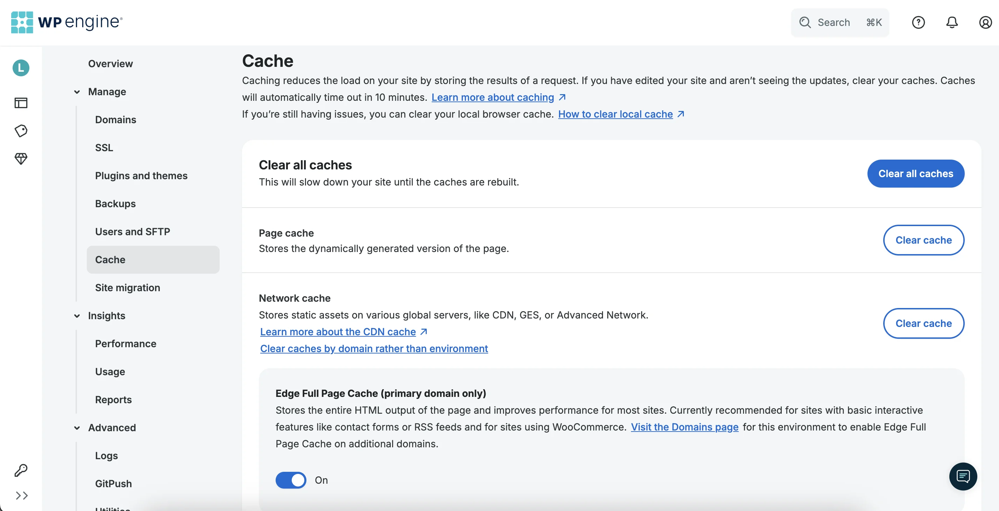

---

## Quick reference — what lives where

| What you want to change | Where to go |
|---|---|
| Section headings | Page editor → click block → right-hand panel → Section Heading |
| Upcoming events | Settings → Black Cap (API token) or page editor → What's On block |
| Story text and photos | Page editor → click Story block → edit in canvas / right panel |
| Timeline entries | Page editor → click Timeline block → edit in canvas |
| TikTok videos | Settings → Black Cap (API credentials) or page editor → Highlights block |
| Drinks menu | Page editor → click Drinks Menu block → right-hand panel → Menu Sections |
| Room names / descriptions / photos | Rooms (left-hand menu) |
| Venue names / descriptions / photos | Venues (left-hand menu) |
| Which rooms appear in Our Rooms | Page editor → Our Rooms block → right panel → Frames |
| Which venues appear in Venue Hire | Page editor → Venue Hire block → right panel → Venue Mapping |
| Social media links | Settings → Black Cap |
| Cache | Settings → Black Cap → Clear API cache |
